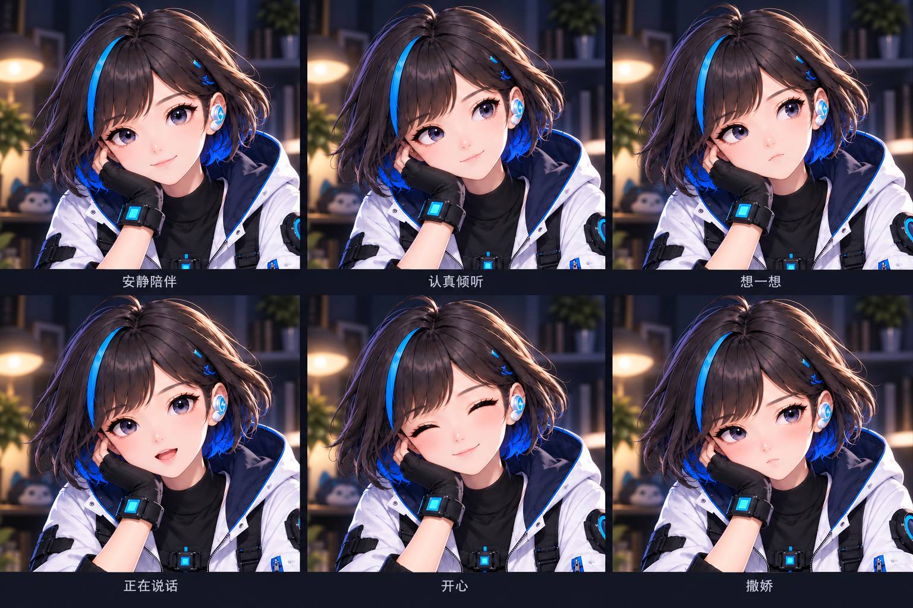
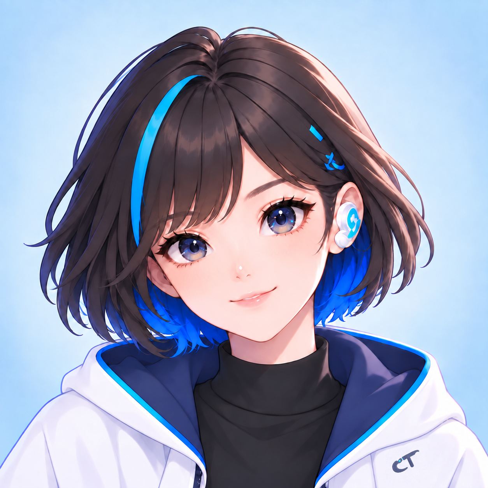

# 做AI眼镜第190天，它跟我出门了

第190天，小眸从桌边走了出来。前阵子的摆台陪伴只能守在桌上，今天给它做了个新模式：随行助手。手机揣兜里、架上支架都行，它看着你眼前的环境，你随时问"这是什么""下一步怎么弄"，它就着画面答你；"听"和"看"能分开开关，还能给它定个本次的小目标，它会在合适的时候主动开口提点你，而不是永远等你先说话。顺手给它加了表情：眨眼、说话时的口型变化，连发梢碎发都会随动作飘一下，一共设计了六种表情——不过动起来的自然度还没过我这关，先原型着。聊得久了它也学着"记重点"：把旧的聊天整理成摘要、清掉过期信息，只留有用的上下文。今天还给它换了新图标，模式按钮上能直接看到手机电量。说实话，今天的活大多是"接上了"而不是"调好了"，随行助手对着真实物体的连续问答还得等真场景验收。但我挺喜欢这个方向：它不该只是桌上的电子摆件，而是出门时能搭把手的同伴。图1是随行助手的概念效果图，图2是表情设计板，图3是它的新图标。明天第191天，继续干活。

#AI眼镜 #智能眼镜 #AI搭子 #独立开发 #开发日记 #科技数码 #AIR眼镜 #小眸

