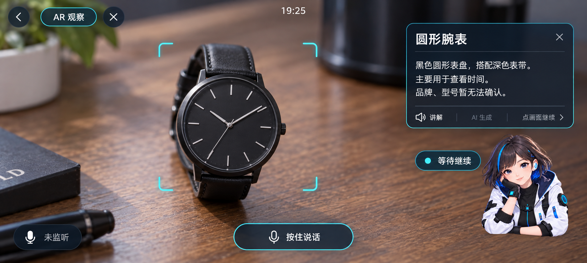
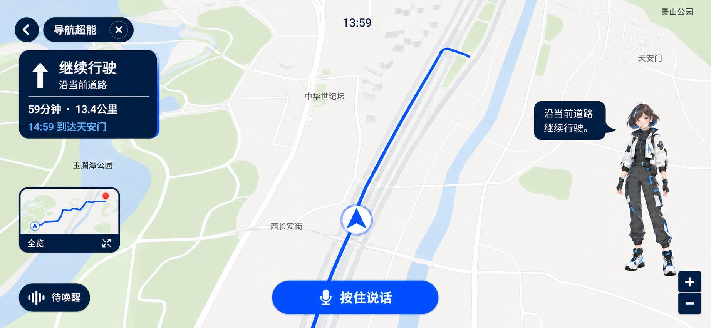
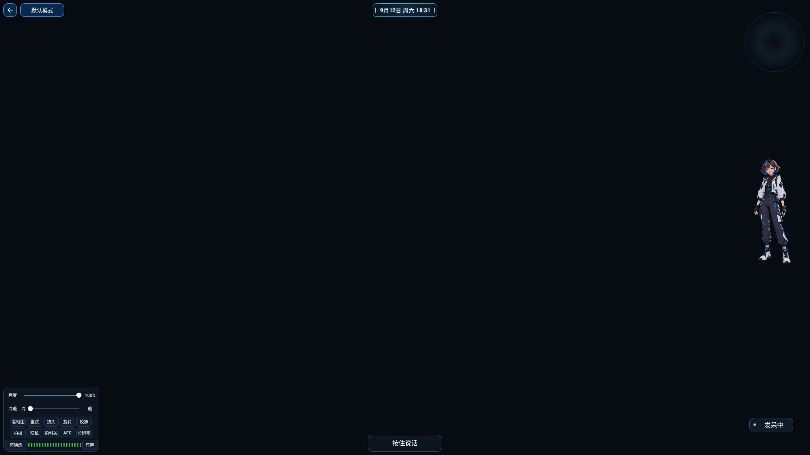

# 做AI眼镜第191天，它第一次离开手机跑起来了

第191天，干了件里程碑的事：AIR第一次离开手机，在一块A7Z开发板上跑起来了，工作台和对话页都能正常显示切换，盯着它跑了半个多小时没出明显问题，排针5V供电也确认走通——这块板子以后就是眼镜的"脑子"，今天算是它第一次睁眼。当然要老实说：没有温度读数和负载记录，散热和长期稳定性还谈不上通过。调试也踩了坑：USB摄像头枚举没筛UVC协议，系统把一个无线模块误认成了摄像头；几个任务共用构建目录，安装包被改写导致签名校验失败，最后给安装脚本加了固定副本机制才消停。实时翻译修好了"把自己的译文录回去"的循环，但同一段31个词的英文对照测试暴露了更大的事：音频不经麦克风直接灌进去，识别错误率也有四成多——瓶颈不在麦克风，在识别模型的英文能力。知道病根在哪，比瞎调参数强。另外驾车、步行、骑行、公交四种导航方式和AR单次观察也都在往前推。图1是AR观察的设计效果图，图2是导航场景效果图，图3是A7Z首次运行的实机截图。第一次看到自己的App在另一块板子上亮起来，还是挺激动的。明天第192天，继续干活。

#AI眼镜 #智能眼镜 #AI搭子 #独立开发 #开发日记 #科技数码 #AIR眼镜 #小眸

