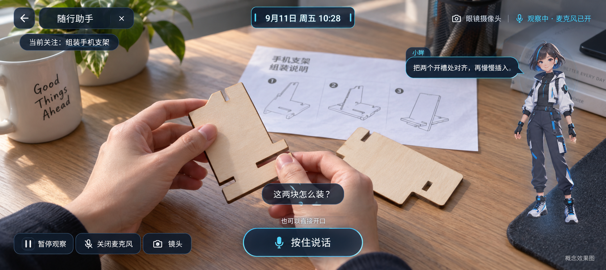
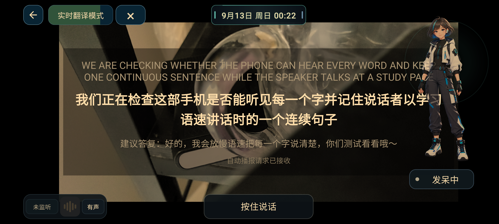
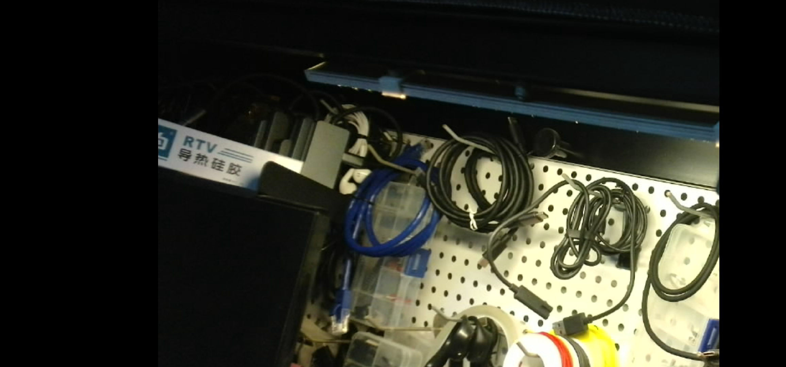

# 做AI眼镜第192天，给它换了个新耳朵

第192天，给小眸换了只"新耳朵"：本地语音识别换成完整版双语流式Zipformer，190MB的模型资产，凌晨就用真麦克风跑通了识别、翻译、播报的整条链路，播报结束才恢复收音，不怕把自己的话录回去了。但新耳朵也有新毛病：低声说话会丢句首，连续说话会被切碎。查下来是起录判断太保守，加了2秒前滚缓冲、确认起录后允许足够能量就持续录，修复包已装，半米低声复测还得再做。今天还有两件事值得记：一是USB镜头终于"眼见为实"——之前指令读写成功只能算纸面功夫，直到实体场景里看到不同手动值引起焦点实际变化，才算真的会调焦；二是解耦重构的新包装上后卡在启动页，定位到隐藏工作台会持续取消整个窗口首帧，一个面板把整个App按住了，修复已交付待复验。另外App里做了独立日记入口，小眸履带机器人的首台样机方案也聊出了雏形；充电宝经排针还是点不亮板子，移动供电继续查。图1是随行助手的概念效果图，图2是换模型后的翻译真机测试截图，图3是USB镜头调焦的现场采样。明天第193天，继续干活。

#AI眼镜 #智能眼镜 #AI搭子 #独立开发 #开发日记 #科技数码 #AIR眼镜 #小眸

