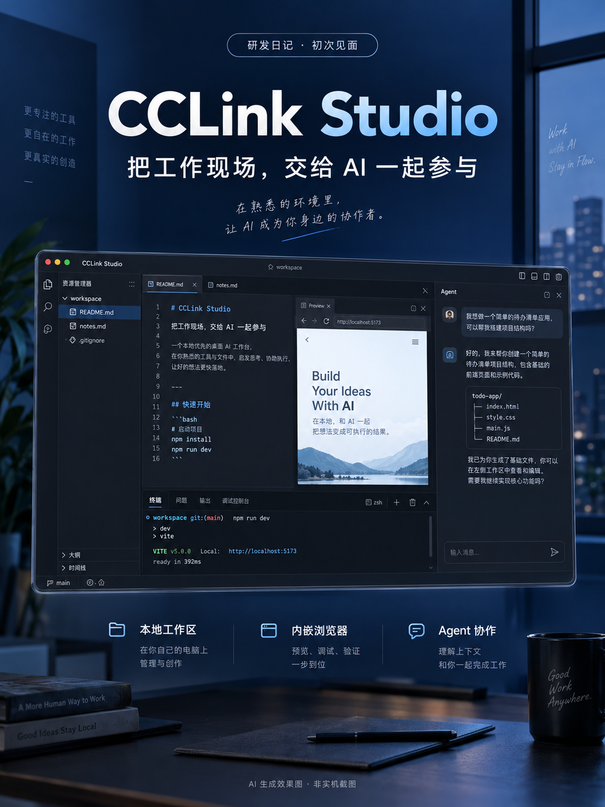
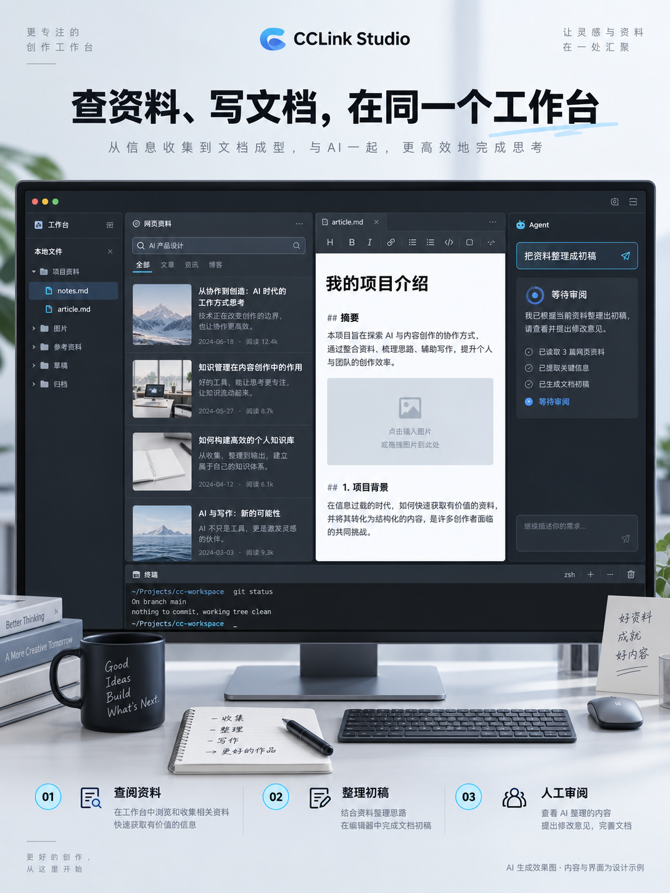
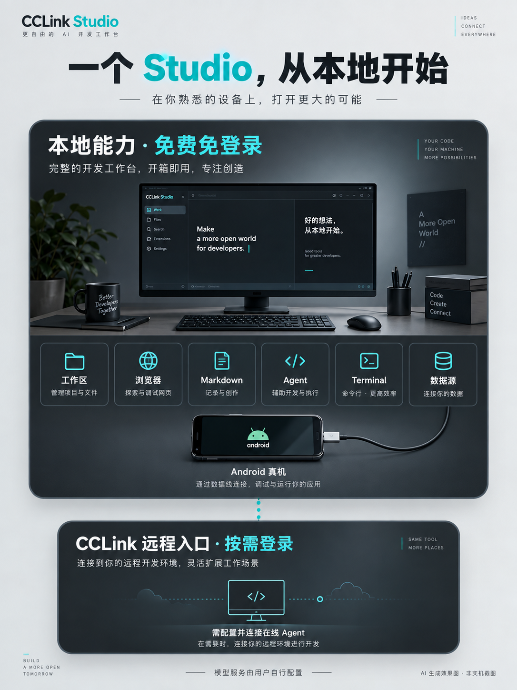

# 从二开 VSCode 到自研：我为什么做 CCLink Studio

2026-09-13 · 研发日记第一篇 · 草稿，未发布

*AI 生成效果图，非实机截图。*

今天介绍一下我一直在做的项目：**CCLink Studio。**

它是一个基于 Electron 自研的开源桌面工作台，服务于我自己的硬件研发、软件研发、软文编写和网页操作需求。

要讲它为什么会出现，得先从一次没有继续走下去的尝试说起。

## 一开始，我尝试的是二开 VSCode

最初，我尝试在 VSCode 的基础上做二次开发。它已经有成熟的工作台、文件管理和编辑能力，从那里起步是很自然的选择。

但做着做着，一个关键问题越来越明显：**我想要的浏览器集成，在那条路上很难做出来。**

因为我的很多工作，实际都发生在浏览器里。

写完一篇文章，要去不同平台投稿；做项目，要进入阿里云、腾讯云等控制台处理事情；做硬件，要查资料、看器件、处理生产相关的网页流程。这些需求让我很在意浏览器在工作台里的位置。

我希望 AI 能真正操作网页，而且是在我的监控下，一步一步地操作。我能看到它打开了哪个页面、填了什么、当前卡在哪里，必要时直接接手，再把任务交还给它。

**浏览器因此成了这个项目的核心。**

经过调研，我最终选择基于 Electron 自己研发 Studio，把浏览器直接集成进应用，也自己掌握工作台和 Agent 之间的交互。

## 驱动我做下去的，是自己的事情

第一类需求，是让 AI 替我处理网页工作。

最直接的例子就是自动投稿：文章和图片已经准备好了，希望 AI 能进入指定平台，使用指定账号，填写内容、上传配图、处理平台字段，并检查最终结果。

我也希望这套能力能继续用于阿里云、腾讯云等网站上的实际操作。碰到验证码、需要本人处理的确认或无法可靠判断的页面，就停下来让我接手。云平台操作是我持续想覆盖的使用场景，并不意味着所有控制台流程都已经做完。

第二类需求，是支持我从研发到表达的整个过程。

做硬件，要看 PCB、FPC、BOM、结构件和数据手册；做软件，要读代码、运行命令、调试手机、检查数据；做完之后，还要写介绍、整理研发记录、配图和发文章。

这些工作都和我手里的项目有关。我希望 Studio 能围绕这些材料和工具逐渐长起来，让 AI 参与其中。

## 市面上有类似产品，为什么还要自己做？

这件事，我很早就开始想，也已经动手做了一段时间。

现在市面上能看到不少类似的 Studio 产品。对我来说，继续自己做的理由依然很明确：**自己的需求，可以自己决定什么时候实现、怎么实现。**

浏览器操作需要更清楚的过程，我就继续完善执行步骤；硬件研发要看 Gerber 和结构件，我就接入对应工具；写软文要配图和投稿，我就把这条流程接起来。

不必等别人的产品路线刚好覆盖我的需求，也不必把自己的工作方式完全交给他们的迭代节奏。

当然，自己做也意味着要自己处理浏览器兼容、登录状态、编辑保存和任务恢复这些麻烦。但能沿着实际使用里的问题持续修改，是我选择这条路的重要原因。

## 现在，Studio 做出了哪些有自己特点的功能？

### 1. AI 在我看得见的浏览器里工作

Studio 把 Chromium 浏览器嵌进了工作台，并接入 Playwright 自动化。Agent 可以读取页面、点击、填写、上传和下载，操作发生在可见的网页现场。

浏览器任务有暂停、终止和人工接管机制；交还给 AI 后，需要重新观察页面再继续。这是最初想法在产品里的具体落点。

围绕日常使用，也做了书签、历史、下载管理和标签页恢复。浏览器既供我自己使用，也承载 AI 的执行过程。

### 2. 管理网站与账号，把投稿做成能追踪的任务

Studio 有统一的“网站与账号”入口，可以管理不同网站、不同账号和账号组。账号登录环境可以跨工作空间复用，不用每换一个项目就重新配置一遍。

文章发布也有了专门的执行计划：从账号和原稿核验，到正文、每张图片、平台字段、保存、提交和结果核验，可以展开查看当前步骤、等待原因及下一步。中断后会按已有草稿和任务事实核验恢复，避免盲目重发。

目前已接入知乎、CSDN、掘金、小红书、微博、头条和 B站动态等平台的发布适配。**其中，知乎和头条已有指定图文在 Studio 中实际提交，并完成公开全文与三图核验的记录。**其他平台仍有不同的审核、账号或结果核验问题，接入不等于每条发布流程都已稳定跑通。

### 3. 给硬件研发做了专门的工具

这一部分很贴近我自己的需求。

Studio 已接入硬件目录扫描、生产包检查和报告工具，能识别原理图、PCB/FPC 源工程、Gerber、BOM、坐标文件、结构件和数据手册，并对支持解析的材料检查缺项、版本线索和 BOM／坐标位号差异。

还做了 **Gerber 层识别、基础轮廓预览，以及 STL、3MF、GLB 等 3D 模型预览**。STEP/STP 则通过可选的本机 FreeCAD 后端转换预览。

针对 FPC 外形调整，也有了只读的上下文准备工具，把外形候选、结构件尺寸状态和缺少的装配信息整理给 Agent。这些能力帮助查看、检查和讨论工程，完整的硬件工作流还在推进，自动改板和生产下单尚未形成交付闭环。

### 4. 写软文时，把正文、图片和排版接起来

Markdown 编辑器支持所见即所得编辑、图片和表格操作，Agent 可以读取、写入、追加并保存文档。

为了写介绍和软文，还接入了 **Markdown 自动配图**：在用户明确要求、配置好图片服务后，生成图片、保存到文档资源目录，再插入正文对应位置。当前接入 Meshy 和即梦图片服务。

另外还有 **微信公众号兼容 HTML 转换**，可以预览、复制和保存排版结果，把本地图片带进导出的 HTML。粘贴到公众号后台后的图片和排版仍需要检查。

还做了从 Markdown 创建**宣发视频工程**的工作台：编辑分镜、旁白和字幕，组织素材，并接入视频生成与合成导出链路。相关界面和代码已接上，真实服务调用及完整视频导出仍待验收。

图片调研也在推进：让 Agent 在可见网页里搜索并提出候选，由我决定保存还是跳过。它目前仍有完整验收待补。

*AI 生成效果图，示意资料、文档与 Agent 在同一工作台协作。*

### 5. 软件研发和真机调试，也留在这个工作环境里

本地文件、源码编辑、终端和 Git 操作组成软件研发的基础：查看变更和 Diff，选择文件提交，在已有上游配置的条件下显式推送。

Android 方面，支持 USB 或 Wi-Fi ADB 真机连接、画面镜像，以及点击、滑动、输入、截图和 UI 读取等工具，让手机上的操作也能进入 Agent 的工作范围。

数据源查询则保持只读，用于查看自己配置的数据，把需要的资料交给 Agent 分析。

### 6. 让协作方式能按任务调整

Agent 会话支持挂载资源和使用 Skill，也有内置及自定义角色。切换角色时保留同一会话的可见历史，方便按任务调整协作方式。

还实现了绑定工作空间的定时任务，首版用于在 Studio 运行期间读取本地资料、生成 Markdown 结果；它目前不承担定时浏览器投稿或云平台操作。

需要跨机器工作时，Studio 还有可选的 CCLink 远程入口。远程文件、Agent 会话和终端已有实现，完整体验继续接受真实在线设备验收。

*AI 生成效果图，非实机截图。*

## 第一篇，先把出发点讲清楚

从尝试二开 VSCode，到选择 Electron 自研，最关键的驱动力一直是：**让 AI 在我的监控下操作浏览器，并帮助我完成硬件研发、软件研发和内容创作里的实际工作。**

这些需求推动 Studio 长出了现在的功能，也会决定接下来优先做什么。

项目使用 GPL-3.0-only 开源。本地能力免费，免 CCLink 登录；Agent、图片生成等外部服务需要自行配置，费用取决于所选服务。远程服务按需登录，有独立的授权与收费条件。

后面的研发日记，我会继续记录具体任务怎么做、遇到了哪些问题，以及自己动手把工具改得更顺手的过程。

项目 Git 地址：[AwsomeName/cclink-studio](https://github.com/AwsomeName/cclink-studio)

下载地址：[最新正式版本](https://github.com/AwsomeName/cclink-studio/releases/latest)（在 Assets 中下载安装包；当前提供 macOS Apple Silicon / ARM64 版）。

#独立开发 #开源项目 #浏览器自动化 #AI工作台 #硬件研发 #开发日记 #CCLinkStudio

---

## 短版文案

最初，我尝试二开 VSCode，但很难把想要的浏览器深度集成进去。

而我的很多工作恰恰发生在网页上：给不同平台投稿，操作阿里云、腾讯云等控制台，查研发资料。我希望 AI 能在我的监控下逐步操作，我能看见过程，也能随时接手。

调研之后，我选择基于 Electron 自己做，这就是 CCLink Studio。

它围绕我的硬件研发、软件研发和软文编写需求，逐渐做出了可见浏览器自动化、网站多账号管理、文章发布计划、Gerber 与 3D 模型预览、硬件生产包检查、Markdown 自动配图、公众号排版和 Android 真机连接等能力；不同流程还在持续打磨。

这件事很早就开始想、开始做了。继续自己动手，也让我的需求不用等别人的产品迭代来满足。

今天开始记录它的研发过程。配图均为 AI 效果图。

项目 Git 地址：[AwsomeName/cclink-studio](https://github.com/AwsomeName/cclink-studio)

下载地址：[最新正式版本](https://github.com/AwsomeName/cclink-studio/releases/latest)（在 Assets 中下载安装包；当前提供 macOS Apple Silicon / ARM64 版）。

## 编辑备注（不随正文发布）

本文的 VSCode 二开经历、Electron 选型动机、云平台操作需求与自主迭代理由，依据作者在本次对话中的明确亲述。未编造具体起步日期，也不声称早于某一家产品。

特色功能逐项核对了项目文档、代码及已有验收记录，详见 [产品梳理依据](2026-09-13/产品梳理依据.md)。本次是文案修订，没有重新运行应用功能验收。

沿用三张 AI 效果图，图片不构成产品功能证据；后续实机内容可补充可见浏览器执行和硬件预览。图片文件、生成方式和提示词见 [素材说明](2026-09-13/素材/README.md)。本文与素材仅本地保存，未发布。
