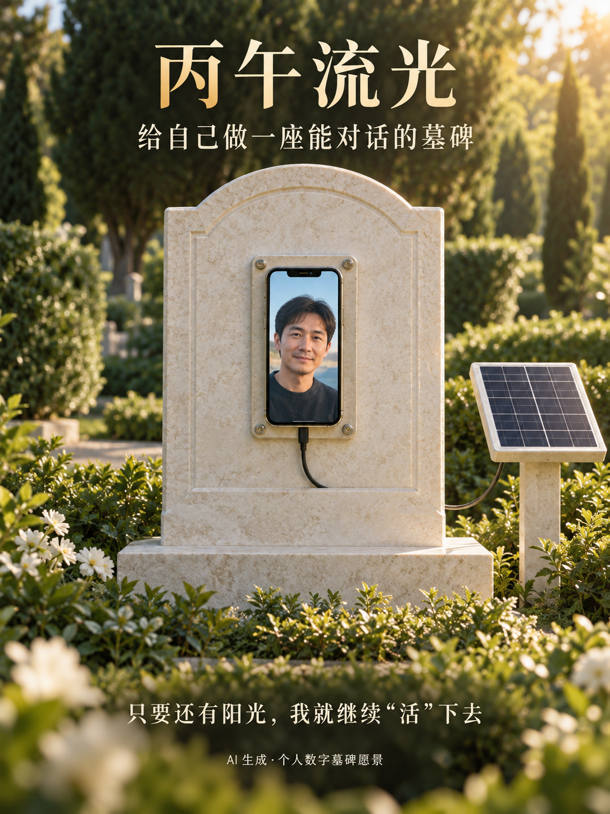
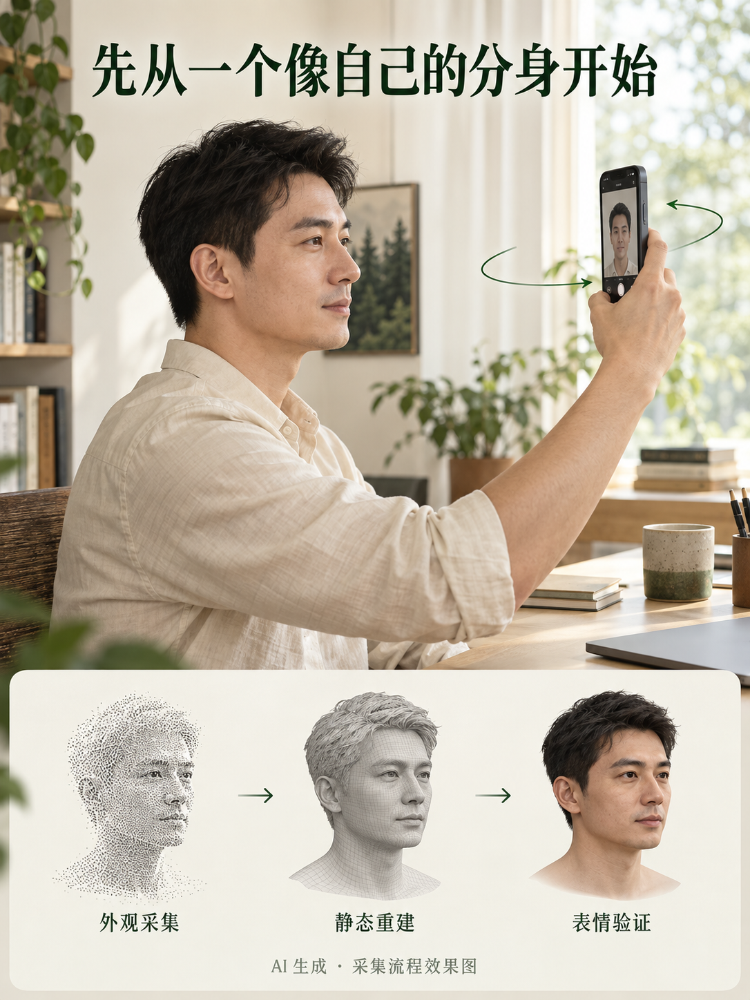
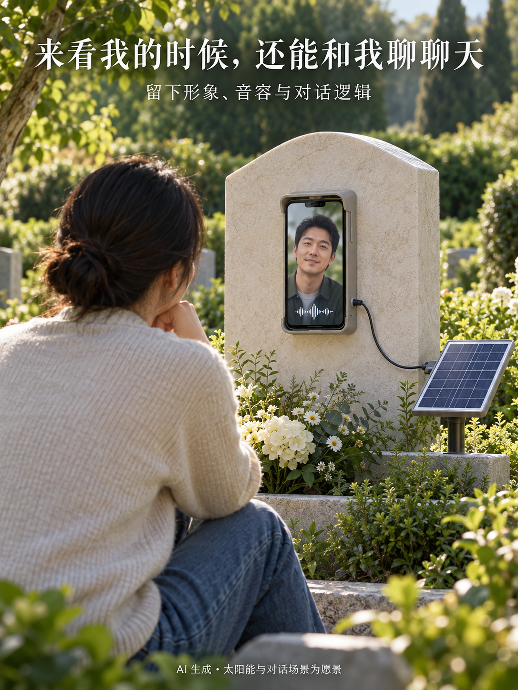

# 丙午流光：给自己做一座能对话的墓碑

> 本文配图全部由 AI 生成，图中人物为虚构人物，界面与数字头部均为概念效果，不是真机截图或实际重建成果。文案整理于 2026 年 9 月 13 日，研发状态依据仓库截至 9 月 10 日的记录。

我做这个项目，最初的想法很直接：**给自己做一座个人墓碑，让自己赛博永生。**

等到有一天我离开了，我想在自己的墓碑上摆一个手机，代替那张静止的照片。

手机里，是提前记录下来的我：我的形象、音容、记忆、表达习惯，还有我理解问题和与人对话的逻辑。有人来看我时，屏幕里的我能看起来像我，用我的声音，按我的思路，和他们聊聊天。

再给它接上太阳能。这就是我想象中的画面：阳光照到墓碑旁的太阳能板上，手机里的我醒着，等着有人来，说一句“好久不见”。

**只要有太阳能，我就能一直“活”下去。**

这句话，就是「丙午流光」最初的愿望。它的英文名是 **Bingwu Light**，是一个从 iPhone 开始的个人数字分身项目。我想趁现在，把自己一点点记录下来，为那座未来的墓碑留下一个能回应的我。

## 我想留下什么

**外观。** 看见这个分身时，能认出是我；转过一点角度，做一个表情，也尽量保留本人的特征。

**声音。** 不只是读出一段话，还希望保留熟悉的音色与说话方式。

**记忆。** 那些我愿意提供的经历、故事和选择，能够成为回答的依据，而不是由模型随意编造一段人生。

**对话逻辑与表达习惯。** 同一个问题，我会怎样理解，依据什么作判断，为什么会这样回答；哪些事会认真，哪些时候会开个玩笑。我希望留下自己思考和回应的方式。

这四件事是长期方向。第一版从本人主动采集开始，以本人授权为前提。

## 现在，先做一个像自己的头部

*AI 生成的采集流程效果图，展示操作方向；图中的人物与模型不代表当前重建精度。*

要做到完整的数字分身，还有很长的路。目前最具体的一步，是先让头部外观成立。

我正在用 iPhone 前置相机探索单人采集：人保持朝前，手机围绕头部移动，记录照片和可用的深度信息，再尝试在手机上重建带纹理的三维头部。当前关注头发、脸、耳朵和颈部，以及正面、小幅侧面和俯仰的可见范围。

静态外观合格之后，再补录表情参考，尝试让这个头部动起来。比如闭嘴、嘟嘴，再放松回到闭嘴；既要看嘴形有没有变化，也要看鼻子和眼睛有没有被一起拉歪。

这段研发里，难点非常具体：眼睛像不像、嘴唇能不能自然分开、侧面会不会变形、张嘴后有没有奇怪的露齿或异物感。生成了一个模型文件，只是开始，还得对照本人实拍看效果。

当前主线是：**外观采集 → 静态重建与验收 → 表情参考 → 一次性加工 → 动态验收。** 手机负责采集与本地预览，现阶段部分加工由开发者在电脑上完成。

## 已经走到哪一步

根据目前保存的研发记录：

- 已有原生 iOS 客户端，正在真机上迭代采集、本地保存、头部预览和动作实验，也加入了分步提示、语音引导、历史记录与重录入口。
- 最近一次已核对的记录中，有一份本人初步接受的静态头部，以及采样完整的正面嘟嘴参考；整体质量与稳定性还需要继续验证。
- 已加入左右固定机位的表情采集与保存，但新协议的真人侧面效果仍待验证，多机位联合加工尚未接入。
- 历史实验做出过张嘴、嘟嘴和圆唇的局部变化，也暴露过歪嘴、鼻眼变形等问题。眼神、眨眼、眉毛和整脸神情还没有完成。
- 服务端基础工程、人格档案与长期记忆的数据模型已有骨架；声音克隆、记忆驱动回答与完整实时对话仍是后续工作。
- 墓碑上的手机、太阳能供电与长期运行是最终使用场景的设想，目前尚未搭建或验证。“一直活下去”是我想追求的愿望，不是已经实现的运行承诺。

所以，现在的丙午流光是一项持续推进的研发探索。下一步仍然是把静态头部和具体动作逐项验收好，再接声音与对话。

## 来看我的时候，还能和我聊聊天

*AI 生成的未来愿景效果图；墓碑装置、太阳能供电和完整对话均尚未实现。*

我希望未来有人走到我的墓碑前，可以像以前见面那样，先打个招呼，再说说最近发生的事。

也可以问我：“你当时为什么想做这个项目？”

屏幕里的我，能够依据留下的真实记录，用我的声音和接近我的对话逻辑，讲讲当时的想法。没有留下答案的事情，就坦白说不知道。

阳光还在，那个小小的屏幕就还有机会亮起来。有人愿意说话，留下的我就还有机会回应。这是我想做的个人墓碑，也是我所向往的赛博永生。

从今天的一次扫描、一个嘴形、一段记录开始，慢慢靠近这个愿望。

这里会记录丙午流光的研发过程：做成了什么，哪里还不像，哪些尝试失败了，以及下一次准备怎样改。

**我是丙午流光。只要还有阳光，我就继续“活”下去。**

---

## 分享短版

我在给自己做一座个人墓碑，项目叫「丙午流光」。我的想法是，提前记录自己的形象、音容、记忆和对话逻辑，未来在墓碑上摆一个手机，代替一张照片。有人来看我，还能和手机里的我聊聊天。再接上太阳能——只要有太阳能，我就能一直“活”下去。这是我想探索的赛博永生。目前正在做 iPhone 头部采集、重建和表情实验，完整对话与太阳能墓碑装置仍是后续愿景。

#丙午流光 #个人墓碑 #赛博永生 #数字分身 #独立开发 #研发日记

## 配图与记录

配图顺序：01 数字墓碑封面（v2）→ 02 采集流程 → 03 墓前对话愿景（v2）。全部采用 AI 效果图，分享时保留效果图标注。生成提示词与素材说明见[配图说明](素材/自我介绍/README.md)。本文及配图仅保存为介绍草稿，尚未发布。

初衷依据：作者在 2026 年 9 月 13 日补充的说明——个人墓碑、记录形象音容与对话逻辑、以手机代替墓碑照片，以及太阳能支持下继续“活”着的愿望。

研发事实依据：主项目 `clone` 的 `README.md`、`docs/naming-memo.md`、`docs/design/branding/selected-brand.md` 与 `docs/workflow-and-page-redesign-29.md`。整理时工程 HEAD 为 `65c78a019ab9e41626eb628dfcefaceecb4ad027`，内容以本地文档为准；本次未重新读取手机或执行真机验收。
